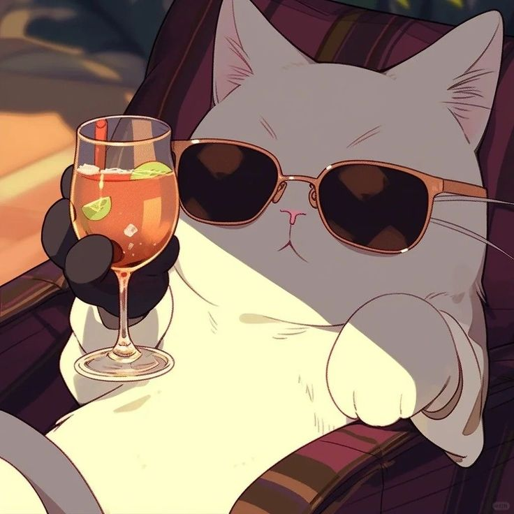

  

  

<h3 aligh="left"> A little more about me...</h2>

I am a passionate developer with hands-on experience in React and Next.js through personal projects. Eager to learn and adapt, I bring dedication, creativity, and a strong ability to grasp new technologies, ready to take on any challenge with confidence.

- 📚 I'm focusing on learning and improving my skills in Next.js, TypeScript, and Node.js.
&nbsp;
- 🚀 I'm always ready to take part in new projects and explore exciting opportunities.
&nbsp;
- 💬 Don't hesitate to reach out — I’m happy to share what I know and help when I can!
&nbsp;
- 🎮 Outside of work, I enjoy playing games, listening to music, spending time with friends, and chilling at cafés whenever I have free time.
&nbsp;
- 📫 Reach out to me at: <a href="le.nttien99@gmail.com">le.nttien99@gmail.com</a>
 

  

<h3>&nbsp;</h3>

<h3 aligh="left">&nbsp; Tech Stack</h3>

<h4 aligh="left">🎨 Front-end</h4>

  

<h4 aligh="left">🤖 Back-end</h4>

  

<h4 aligh="left">🛢️ Database</h4>

  

<h4 aligh="left">🛠 Other</h4>

  

<h3>&nbsp;</h3>

<h3 aligh="left"> GitHub Stats</h2>

    
    

<h3>&nbsp;</h3>

<h3 align="center">
    
</h2> 

  
<h3 aligh="left"> Contact with me</h2>

  

<!-- https://icons8.com -->

 
  
<!--    -->
  

  
